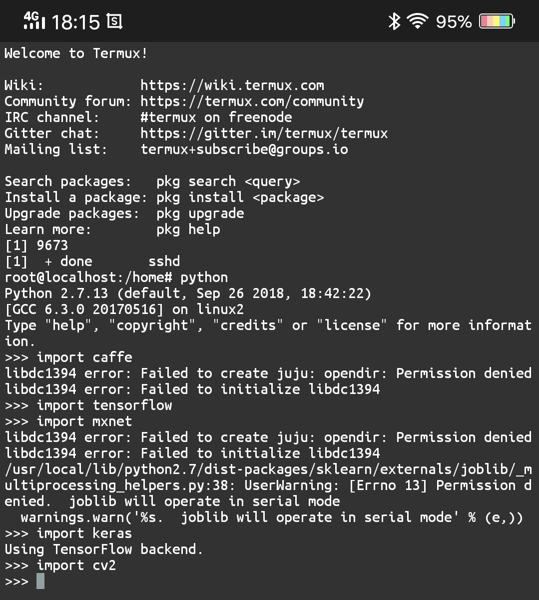

The packet is include: Graphical User Interface in Termux

1. A GUI-App.
2. you can open the camera in the termux-linux,and show in the GUI-App
3. you can run use opencv to show GUI-App
4. already import caffe,tensorflow,mxnet,keras,cv2 for the python（have the warning，but all the frames work!）

In a words,now you have a complete linux with a GUI running in the android and programe your ai code in it. 

<b>Will be release beta V0.1 soon...</b> 
(all is done, but too large ,  need delete some useless files )
